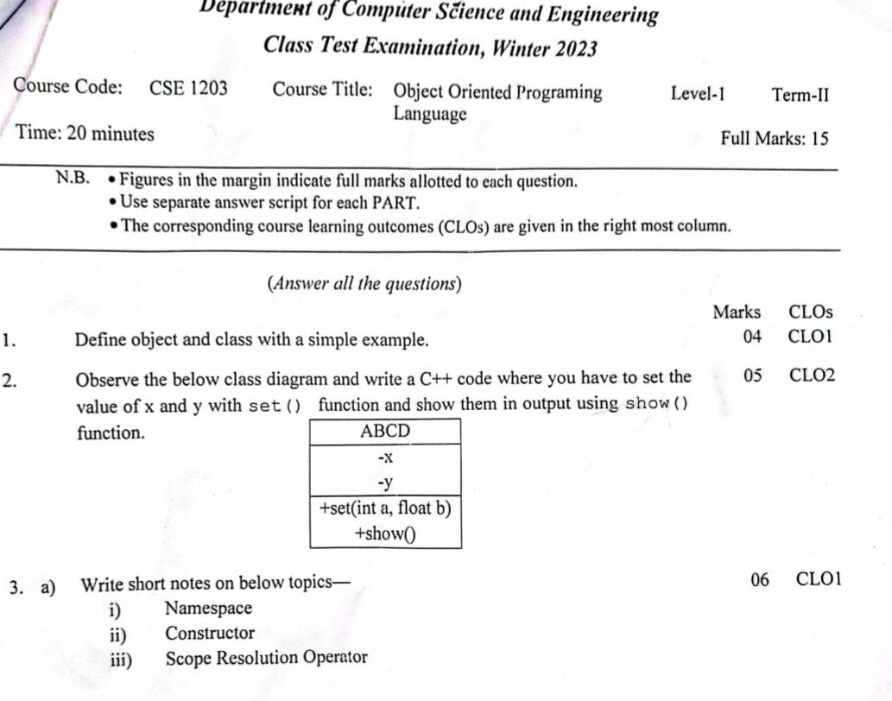
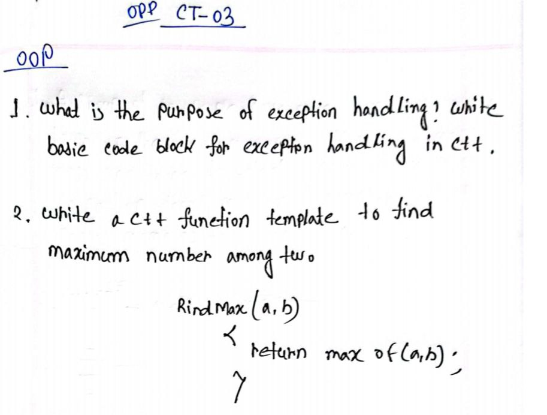

# <mark>CSE-1203-exam </mark>
- [x] [CT-Solution](##*__CT__*),[^1]
- [x] [Mid-Solution](##MID),
- [x] [Lab-Solution](##Lab),
    
[^1]: ## *__CT__*
___Question CT-1___

 

***Solution:***
>

  
___Question CT-2___

 

***Solution:***
>

  
___Question CT-3___

 

***Solution:***
>

    
## *__MID__*

    
## Lab