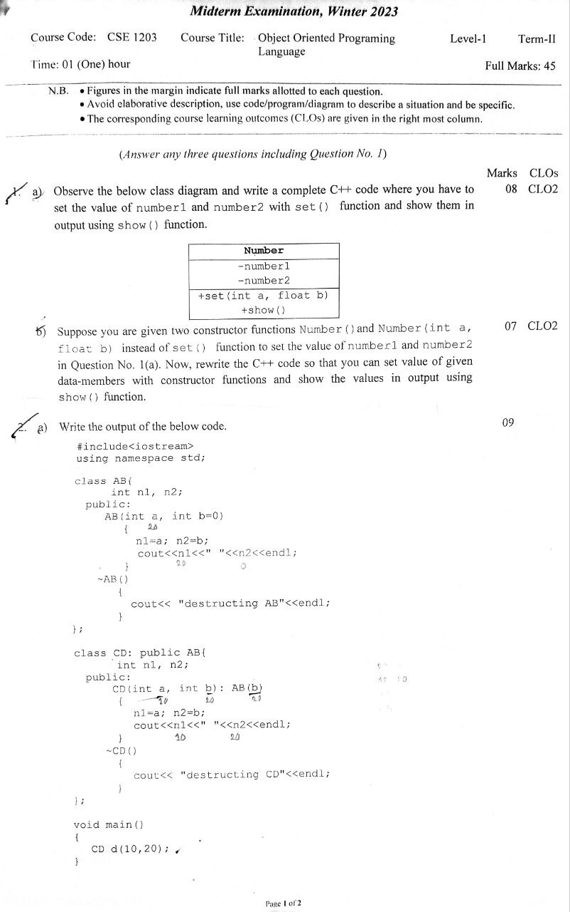

# <mark>CSE-1203-exam </mark>
- [x] [CT-Solution](##*__CT__*),
- [x] [Mid-Solution](##MID),
- [x] [Lab-Solution](##Lab),
<br><br><br><br>
## *__CT__*
### ___Question CT-1___


<br>

***Solution:***
<br>
### <mark>___Answer No. - 01___</mark>

**Class:** A user defined data type which holds its own data members and member functions which can be accessed and used by creating an instance of that class.

**Object:** Any class type variable or  an instance of a class is called an object.

Here is an simple code example:
```cpp
#include <iostream>
using namespace std;

class MyClass {
public:
    int x;
    MyClass(int val) : x(val) {}
    void print() {
      cout << x << endl;
    }
};

int main() {
  MyClass obj(5);
  obj.print();
  return 0;
}
```

<br><br>
### <mark>___Answer No. - 02___</mark>
```CPP
#include<iostream>
using namespace std;

class ABCD{
private:
    int x,y;

public:
    void set(int a, int b){
        x=a;
        y=b;
    }

    void show(){
        cout<<x<<" "<<y;
    }
};

int main(){
    ABCD obj;
    obj.set(7,5);
    obj.show();
    return 0;
}
```
<br><br>
### <mark>___Answer No. - 03(a)___</mark>

* **Namespace :**
> A namespace is a container for identifiers that helps organize code by grouping related classes, functions, and variables under a unique name. It defines a scope or context in which identifiers are used and prevents naming conflicts by allowing for the use of the same identifier name in different parts of a program without causing conflicts.

* **Constructor :**
> A special type of function that is used to initialize the object. It is called at the time of object creation.

* **Scope Resolution Operator :**
> The scope resolution operator :: is used in C++ to specify the context of an identifier and to access hidden or out-of-scope elements. It helps prevent naming conflicts.

<br><br>
### ___Question CT-2___


<br>

***Solution:***
### <mark>___Answer No. - 01___</mark>
>

<br><br>
### ___Question CT-3___


<br>

<mark>***Solution:***
### ___Answer No. - 01___
</mark>

> Purpose of exception handling is to help programs deal with unexpected situations or errors that may occur during runtime. By using structured techniques to detect and respond to these exceptional conditions, developers can prevent their programs from crashing and ensure that they continue to run smoothly even when unexpected events occur.

>In C++, exception handling is implemented using try, catch, and throw blocks. The try block contains code that may throw an exception, and the catch block handles the exception. If an exception is thrown, the program jumps to the catch block.:
```cpp
#include <iostream>
using namespace std;

int main() {
    try {
        // code that may throw an exception
        throw "An error occurred";
    } catch (const char* msg) {
        // code to handle the exception
        cerr << msg << endl;
    }
    return 0;
}
```
or
```cpp
#include <iostream>
using namespace std;

int main() {
    int num1, num2;
    cin>>num1>>num2;
    try {
        if(num2==0)
            throw "An error occurred";
        double result = (double)num1/num2;
        cout<<"result : "<<result<<endl;
    } catch (const char* msg) {
        cerr << msg << endl;
    }
    return 0;
}
```
<br><br>
### <mark>___Answer No. - 02___</mark>
>A generic template is a tool in C++ that lets programmer to write code that works with many data types. It helps to avoid writing the same code for each data type, making your code more flexible and easier to maintain. 

```cpp
#include <iostream>
using namespace std;

template <typename T>
T max(T x, T y) {
    return (x > y) ? x : y;
}

int main() {
    cout << max(3, 7) << endl; // 7
    cout << max(3.0, 7.0) << endl; // 7
    cout << max('a', 'b') << endl; // b
    return 0;
}
```

<br><br><br><br>
## *__MID__*
### ___Question Mid___



### <mark>___Answer No. - 01(a)___</mark>
```cpp
#include<iostream>
using namespace std; 
class Number{
        int number1, number2;
    public:
        void set(int a, float b)
        {
            number1 = a;
            number2 = b;
        }
        
        void show()
        {
            cout<<number1<<" "<<number2<<endl;
        }
};
int main(){
    Number n;
    n.set(7, 5.00);
    n.show();  //7 5
    return 0;
}
```
<br><br>
### <mark>___Answer No. - 01(b)___</mark>
```cpp
#include<iostream>
using namespace std;

class Number{
        int number1,  number2;
    public:
        Number(){number1 = 0; number2 = 0;}
        Number(int a, float b)
        {
            number1 = a;
            number2 = b;
        }

        void show()
        {
            cout<<number1<<" "<<number2<<endl;
        }
};

int main()
{
    Number obj, obj1(7, 5.00);
    obj.show(); //0 0 
    obj1.show(); //7 5
    return 0;
}
```
### <mark>___Answer No. - 02(a)___</mark>
```cpp
#include <iostream>
using namespace std;

class AB
{
    int n1, n2;

public:
    AB(int a, int b = 0)
    {
        n1 = a;
        n2 = b;
        cout << n1 << " " << n2 << endl;
    }
    ~AB()
    {
        cout << "destructing AB" << endl;
    }
};

class CD : public AB
{
    int n1, n2;

public:
    CD(int a, int b) : AB(b)
    {
        n1 = a;
        n2 = b;
        cout << n1 << " " << n2 << endl;
    }
    ~CD()
    {
        cout << "destructing CD" << endl;
    }
};

int main() // class object niye kaj korle obosshoi c++ a return type int hobe
{
    CD d(10, 20);
    return 0;
}

```
**Output:**
```out
20 0
10 20
destructing CD
destructing AB
```
>Here parent class constructor are being call at first and then the child class constructor but in the case of destructor is opposite.

### <mark>___Answer No. - 02(b)___</mark>
* __Access modifier:__
> In C++, access modifiers are keywords that control the accessibility of member variables and member functions of a class. They are used to implement data hiding, which is an important concept in object-oriented programming. Data hiding means that some data and functions in a class are hidden from the outside world, so they can only be accessed by certain functions. Access modifiers are used to implement the principle of encapsulation in Object-Oriented Programming (OOP).

> There are three types of access modifiers in C++: public, private, and protected. When a member variable or member function is declared as public, it can be accessed from anywhere in the program. When a member variable or member function is declared as private, it can only be accessed from within the class. When a member variable or member function is declared as protected, it can only be accessed from within the class and its derived classes.

* __Friend Function:__
> A friend function in C++ is a special type of function that is not part of the class but can still access the private and protected data in the class.

<br><br>
### <mark>___Answer No. - 03(a)___</mark>
```cpp
#include<iostream>
using namespace std;

class BAUST{
public:
    string cse;
    void show(){cout<<"Nahid"<<endl;}
private:
    string eee;
protected:
    string me;
};

class MIT: private BAUST{
    //all private but private will not inherit
};

class IIT: protected BAUST{
    //all members are protected but private will not inherit
};

int main()
{
    BAUST ob;
    MIT obj;
    IIT object;
    ob.show();
    //obj.show(); //inaccessible private properties
    //object.show(); //same here
    return 0;
}
```
<br><br>
### <mark>___Answer No. - 03(b)___</mark>
```cpp
#include<iostream>
using namespace std;

class A{
public:
    int x;
    A()
    {
        cout<<"A called"<<endl;
    }
protected:
    int y;
private:
    int z;
};

class B: public A{      //multi level
public:
    B()
    {
        cout<<"B called"<<endl;
    }
};

class C: protected A{   //multi level
public:
    C(){
        cout<<"C called"<<endl;
    }
};

class D: public B, private C{   //multiple inheritance
};

int main()
{
    A a;
    cout<<endl;
    B b;
    cout<<endl;
    C c;
    cout<<endl;
    D d;
    return 0;
}

```
<br><br>
### <mark>___Answer No. - 04(a)___</mark>
```cpp
#include<iostream>
#include<cstring>
using namespace std;

class car;
class bike{
        char model[20];
        float speed;
        int passengers;
    public:
        bike(const char m[], float s, int p)
        {
            strcpy(model, m);
            speed = s;
            passengers = p;
        }

        friend void compareSpeed(car car1, bike bike1);
};

class car{
        char model[20];
        float speed;
        int passengers;
    public:
        car(const char m[], float s, int p)
        {
            strcpy(model, m);
            speed = s;
            passengers = p;
        }

        friend void compareSpeed(car car1, bike bike1);
};

void compareSpeed(car car1, bike bike1)
{
    if (car1.speed > bike1.speed){
        cout << "Car is faster than bike" << endl;
    } else if (bike1.speed > car1.speed){
        cout<<"Bike is faster than Car"<<endl;
    } else {
        cout<<"Car and Bike are at same speed"<<endl;
    }
}

int main()
{
    car car1("Toyota", 120.4,4);
    bike bike1("Yamaha", 80.0,2);
    compareSpeed(car1, bike1);
    return 0;
}
```
<br><br><br><br>

## Lab

cout